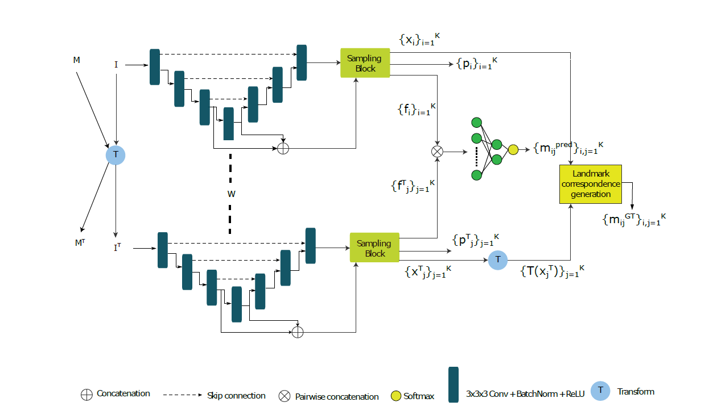
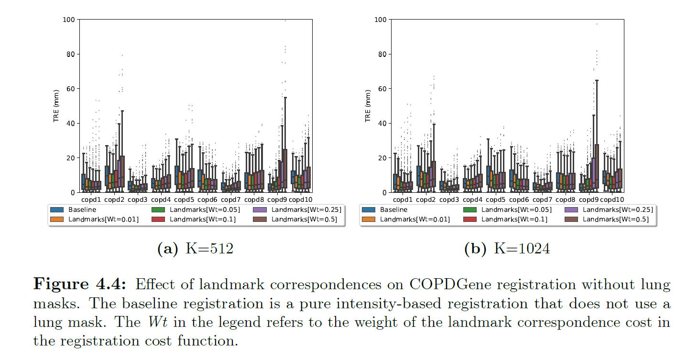
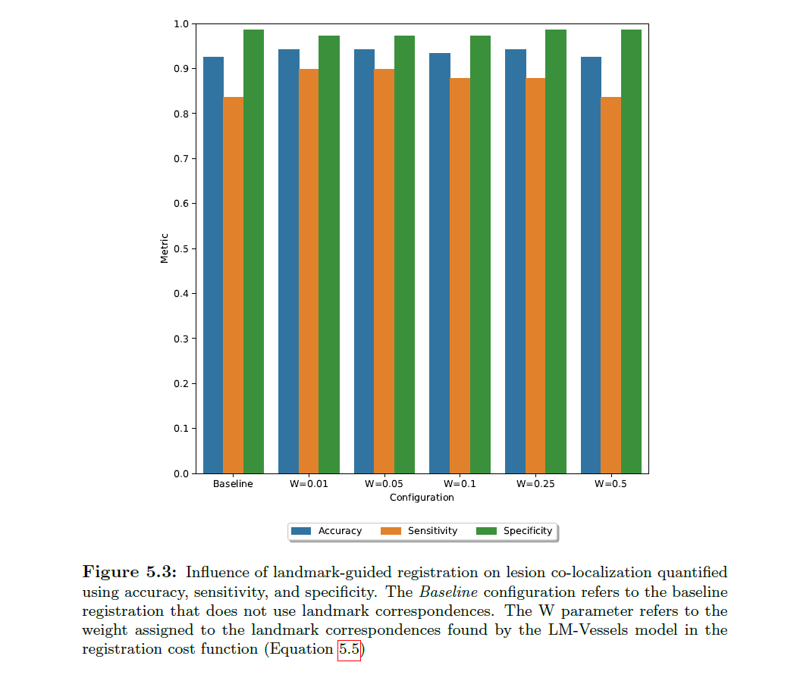

# Landmark-guided deformable image registration 

We study the influence of (learned) landmark correspondences on intensity-based deformable image registration involving "hard" organs like the lung and liver. Our work extends the self-supervised model developed by [Grewal et al. (2023)](https://www.spiedigitallibrary.org/journals/journal-of-medical-imaging/volume-10/issue-01/014007/Automatic-landmark-correspondence-detection-in-medical-images-with-an-application/10.1117/1.JMI.10.1.014007.full#_=_) by proposing the use of a mask during training to focus the model on key anatomical structures (e.g. vessels inside the liver). 

We demonstrate the benefits our *soft mask* extension using two use-cases:
* Lung CT registration (using the 4DCT and COPDgene datasets)
* Liver lesion co-localization (using a dataset of dynamic contrast-enhanched (DCE) MR images collected at UMC Utrecht)

# Model

# Results

### Lung CT registration

### Liver lesion co-localization

# Usage

Use the following to clone the repository and install packages.

    git clone https://github.com/ishaanb92/LandmarkBasedRegistration.git
    python setup.py install

You will also need to install Elastix yourself from [here](http://elastix.lumc.nl/download.php). Set the `elastix_path` and `transformix_path` to the paths where you installed the binaries for `elastix` and `transformix` when using the `ElastixInterface` and `TransformixInterface` classes during registration. 

## Citation
If you use this code in your work, you can cite the following publication:
Plain text: Bhat I, Kuijf HJ, Viergever MA, Pluim JPW. Influence of learned landmark correspondences on lung CT registration. Med Phys. 2024; 1-16. https://doi.org/10.1002/mp.17120 
BibTex:
@article{https://doi.org/10.1002/mp.17120,
author = {Bhat, Ishaan and Kuijf, Hugo J. and Viergever, Max A. and Pluim, Josien P. W.},
title = {Influence of learned landmark correspondences on lung CT registration},
journal = {Medical Physics},
volume = {n/a},
number = {n/a},
pages = {},
keywords = {deep learning, image registration, landmark correspondence},
doi = {https://doi.org/10.1002/mp.17120},
url = {https://aapm.onlinelibrary.wiley.com/doi/abs/10.1002/mp.17120},
eprint = {https://aapm.onlinelibrary.wiley.com/doi/pdf/10.1002/mp.17120},
}

## Useful links
* [Open Access link to paper](https://aapm.onlinelibrary.wiley.com/doi/pdf/10.1002/mp.17120)
* [Elastix manual](https://elastix.lumc.nl/download/elastix-5.1.0-manual.pdf)
* [Using gryds to deform images](https://github.com/tueimage/gryds/blob/master/notebooks/tutorial.ipynb)
* [Why do we need landmarks?](https://iopscience.iop.org/article/10.1088/0266-5611/24/3/034008)

